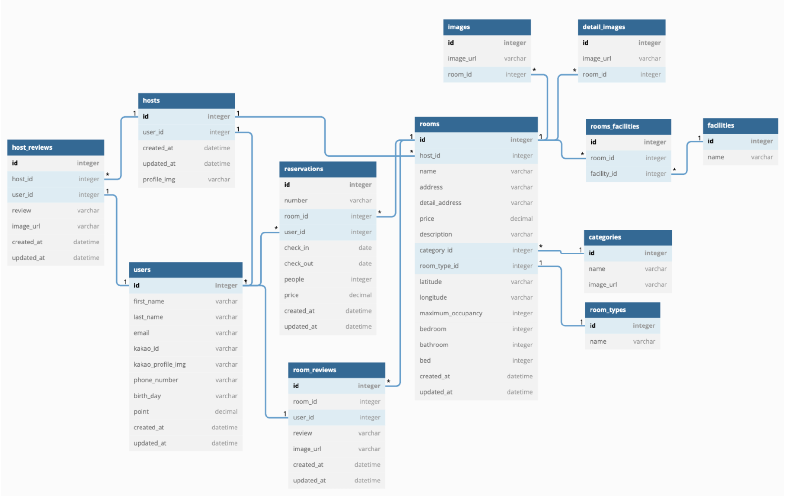

# AirBnB Service

<bt>

##### <본 프로젝트는 팀 프로젝트 이후 `Django REST FrameWork`를 적용하기 위한 개인 프로젝트 입니다> 
##### <팀 프로젝트의 레포지토리는 https://github.com/wecode-bootcamp-korea/35-2nd-WnB-backend 을 참조해주세요!!>
<br>


### 호텔사이트의 예약과 고객의 흐름에 맞는 REST API 작성  


<br>

## 목차

  * [개발 기간](#개발-기간)
  * [개발 인원](#개발-인원)
  * [프로젝트 개요](#프로젝트-개요)
      - [프로젝트 설명](#01-프로젝트-설명)
      - [개발 조건](#02-개발-조건)
      - [사용 기술](#03-사용-기술)
      - [모델링](#04-모델링)
      - [디렉토리 구조](#05-디렉토리-구조)
  * [프로젝트 분석](#프로젝트-분석)
  * [API ENDPOINT](#api-endpoint)


<br>

## 개발 기간
**2022.11.19 ~ 2022.11.21** 

<br>
<br>
  
## 개발 인원
**Back-end  : 김도연**

<br>
<br>


## 프로젝트 개요


<br>

#### 01. 프로젝트 설명

<u> 호텔예약사이트의 기능들을 분석하여 자유롭게 API를 구현했습니다.</u>
 
<br>
<br>

#### 02. 개발 조건

> <br>
>
> * **데이터**
> 	* AirBnB 사이트의 데이터 분석 후 필요한 데이터 추출
> 	* 데이터에 맞는 모델링 실시
>
><br>
>
> * **API**
>
>   *   **회원가입 & 로그인**
>       * 인가된 사용자에 한해서 서비스 가능 기능 구현
>    
>   *   **메인페이지 room 리스트 정보**
>        * 예약시 필요하다고 생각되는 필터팅 자유롭게 구현
>
>   *   **상세 room 정보**
>        * 예약시 고객에게 필요한 정보 자유롭게 구현
>   
>   *   **예약**
>        * 예약 생성, 조회, 삭제 기능 구현
>
>
> <br>

<br>
<br>


#### 03. 사용 기술 

- **Back-End** : Python, Django, Django REST Framework
- **Database** : MySQL, dbdiagramio
- **HTTP**     : Postman
- **ETC**      : Git, Github, Miniconda


<br>
<br>

#### 04. 모델링

<br>


<p align="center"></p>

<br>

- 호텔예약 사이트의 일반적인 데이터를 고려하여, `User(유저)`, `Room(방)`, `Resrvation(예약)` 을 주요 테이블로 설정했습니다.
	- `User(유저)`는 **여러 개**의 `Resrvation(예약)` 객체를 가질 수 있습니다.

<br>

-  `Room(방)`에는 room별로 제공되는 편의시설이 다르기 때문에 `facilities` 테이블을 만들었습니다.
    - `Room(방)` 테이블과 `facilities`  M:N 관계로, 관계 해소를 위해서 중간테이블 `RoomFacility` 을 설정했습니다.
    - 
<br>

-  `Image`, `DetailImage`, `Category` 테이블의 경우 상품과의 관계는 1:N 입니다.
    - 하나의 `Room`는 여러개의 `Image` `DetailImage` 가질 수 있습니다.
    - 하나의 `Room`는 하나의 `Category`에 포함됩니다.

-  `Room`은 하나의 `RoomType`를 가지기 때문에 관게는 1:1입니다.
    - 1:1의 경우 `Room`에 추가로 필드를 설정해도 되지만, `RoomType`이라는 객체가 필터링시 사용될 수 있는 고유한 객체라고 생각했기 때문에 따로 테이블을 생성했습니다.

<br>
<br>

#### 05. 디렉토리 구조
<br>


```
.
├── __pycache__
├── configs
├── decorators
├── host
├── reservations
├── reviews
├── rooms
    ├── utils
├── users 
    ├── utils
├── wnb 
├── wnb_csv_file
├── exceptions.py
├── manage.py
├── requiremenets.py
└── wnbuploads.py
 
```


<br>
<br>

## 프로젝트 분석

<br>

- `users`, `rooms`, `reservations`로 분리하여 앱을 생성했습니다.   
<br>

- User API
    - 회원가입 & 로그인
        - `bcrypt` 모듈을 이용해서 데이터베이스의 패스워드 암호화
        - `jwt` 모듈을 이용해서 인가를 위한 token 발급
        - decorator를 구현해서 인가가 필요한 기능에 추가

<br>
<br>
<br>

- Rooms API
    - 어려웠던점
        - `쿼리파라미터`로 많은 정보가 들어 올 경우 데이터 처리를 어떻게 해야 할 지 고민 되었습니다.
        - 외래키로 연결된 테이블에 대해서 `정참조`, `역참조`를 serializer에서 구현하는 방법이 고민되었습니다.  
        
    - 해결방법
        - `쿼리파라미터`를 rooms.utils에 따로 구현하여 필터링을 처리했습니다.
        - `nest serializer`를 활용해서 room serializer에 옵션의 model serializer를 포함 시켜 주었습니다.
        - `source` 옵션을 이용해서 model에서 `정참조`, `역참조`를 해결했습니다.
    - 설명
        - room 리스트 출력 
            - `Q`를 이용해서 쿼리파라미터로 들어오는 요청데이터를 하나의 조건 통합
            - `check_in`과 `check_out`의 경우 `field lookups`의 `gte` `lte`를 활용 예약되지 않은 방을 필터링
            - 중첩된 `RoomModelSerializer`를 활용해서 참조되는 데이터를 함께 출력
            - `many=True` 옵션으로 필터링에 걸리는 해당 객체 모두를 dict 형태로 반환
        
        - 특정 room 출력
            - `path 파마미터`로 room을 특정
            - 최적화를 위해서 room에 정참조인 경우는 `select_related`, 역참조인 경우는 `prefetch_related`로 헤당 객체 반환
    

<br>
<br>
<br>

- Reservation API
    - 어려웠던점
        - 방 리스트 출력시 room과 비슷한 문제로 참종 데이터에 대한 출력방법이 고민 되었습니다.
        - 모델에서 분리된 필드(first_name, last_name 등)을 하나로 합쳐서 serializer에서 출력하는 방법이 고민 되었습니다.
    
    - 해결
        - 리스트 출력시 serializer에 `source` 옵션과 `nest serializer` 을 활용해서 reservation 객체에 대한 정보를 출력했습다.
        - model에서 `@property`로 사용될 속성을 정의해서 full_name(first_name+last_name)을 출력했습니다.
    
    - 설명
        - Researvation 생성
            - 정의한 `serializer`를 이용, 요청으로 들어오는 파라미터에 대해서 유효성 검사 후, modelserializer를 이용해서 reservation 객체 생성   
        
        - Reservation 전체 리스트 조회
            - `중첩 serailzier`로 특정된 객체를 모두 반환
        
        - 특정 Reservation 조회
            - `path 파라미터`로 reservation 객체 특정 후 serializer로 해당 객체 dict 형태로 반환
             
        - 특정 Reservation 삭제
            - `path 파라미터`를 활용해서 reservation 객체를 특정 후 삭제
<br>
<br>
<br>
<br>
<br>


## API ENDPOINT

### users

URL|Method|Description|
|------|---|---|
|"/users/signup"|POST|회원가입|
|"/users/login"|POST|로그인|

<br>
<br>
<br>

### products

URL|Method|Description|
|------|---|---|
|"/rooms"|GET|전체 room 리스트 출력 |
|"/rooms/\<int:room_id>"|GET|특정 room 출력 |

- 리스트 출력의 경우 min_price, address, room_type_ids, bed, bedroom, bathroom, category, faciliry_ids, maximum_occupanct, check_in, check_out을 쿼리 파라미터로 정할 수 있다.

<br>
<br>
<br>

### carts

URL|Method|Description|
|------|---|---|
|"/reservations"|POST|예약 객체 생성|
|"/reservations"|GET|예약 리스트 출력|
|"/reservations/\<int:reservation_id>"|GET|특정 예약 객체|
|"/reservations/\<int:reservation_id>"|DELETE|특정 예약 객체 삭제|
